# ECE16 Lab1 Report
By: Alan COntreras A14626630

>Q. When you open the conflicted readme, what did you get? How did you fix it?

>A. The conflict I got was that updates were changes made remotely that
>I did not have locally. So I need to do a pull before pushin any new
>information out. I did this and the conflict was resolved.
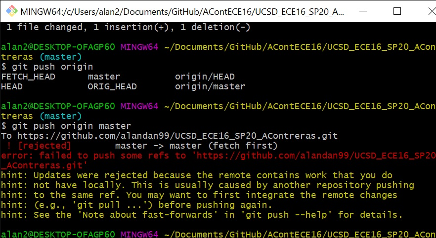
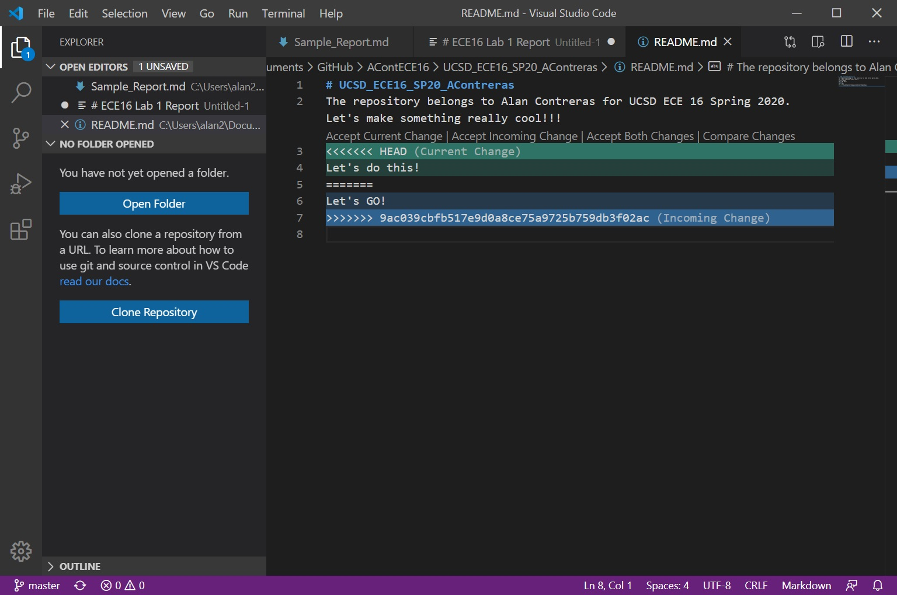
### Challenge 1:

>The objective for Challenge 1 is to clone my repository to my local
>machine. Using what I learned in the Lab Tutorial, I was able to clone
>the repository I created into my computer.
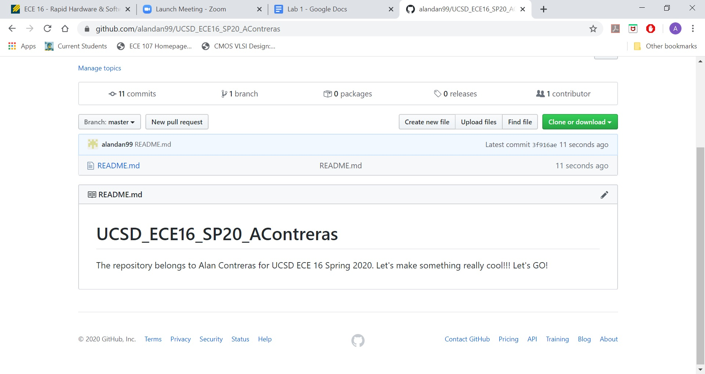
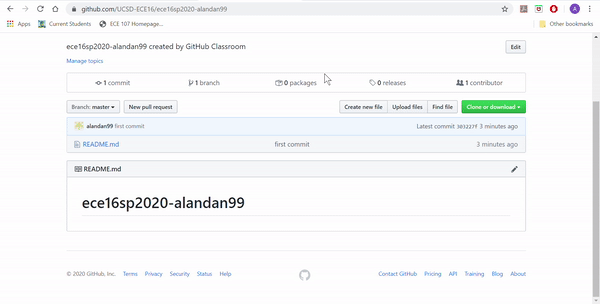

### Python Basics tutorial

>This was a section of the lab where I am introduced to Python and go through some tutorials to gain some basics of Python

>Q.Show the code: Starting with a = “Hello World!!!”, come up with a code snippet that will give us b = “Hello” and c = “World” and d = “!!!” . Also, in code, check if “ello” is in a. 

>A. I set the variable a to have the string "Hello World!!!" and I set 
>b, c, d accordingly using the slice operation on a. 
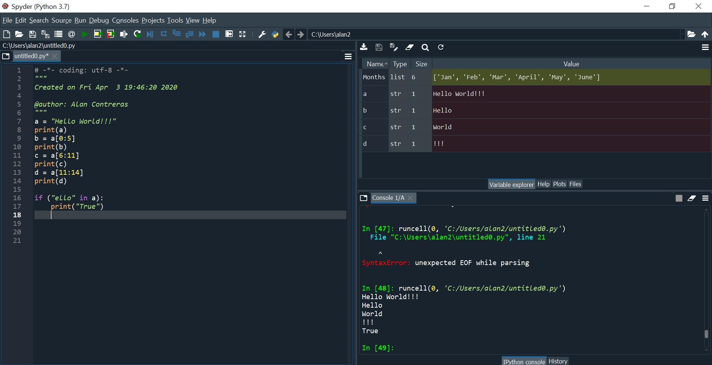

>Q. In the following code, what is the output of the print statement? Why doesn’t original_list = ['hi','how','are','you']?

>A. The output when I run the code is ['hi', 1, 2, 'you']. The reason the
>output does not give out ['hi','how','are','you'] is because the the
>variable being displayed is never updated with the new changes. Also, the
>values being sliced in the updated list do not output the desired list
>either. By having the correct list index, and the correct list to be 
>updated, you'll get the desired list. 

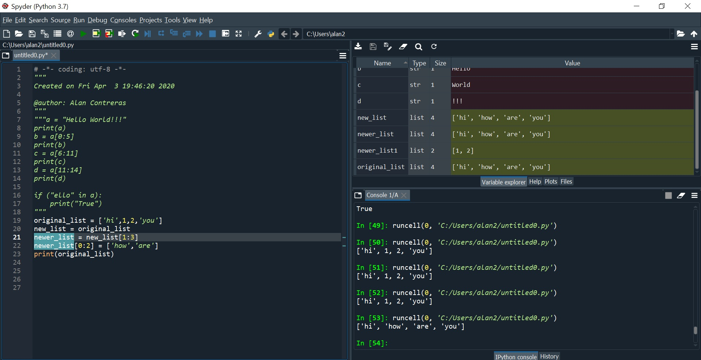
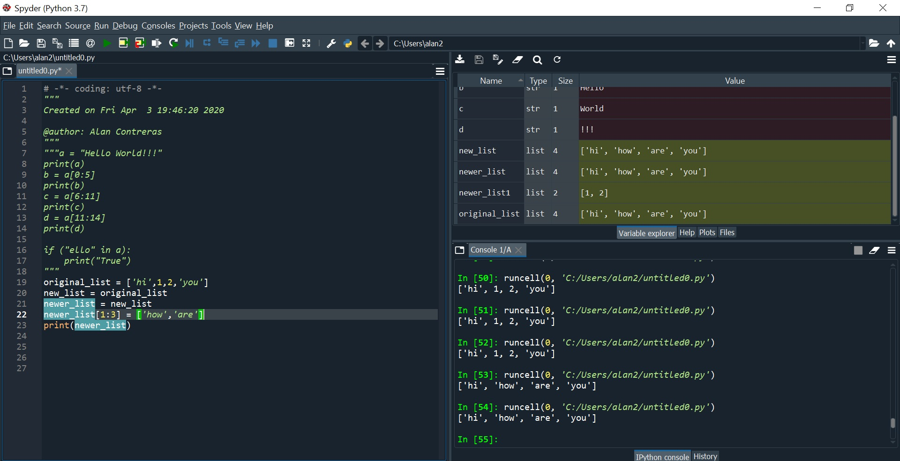

### Challenge 2
>The objective of this challenge is to familiarize ourselves with Numpy,
>a numerical computation package in Python that focuses on mathematical
>operations on arrays.Numpy arrays are like list data structure in Python,
>but Numpy arrays are designed for numeric operations and can be
>multi-dimensional

>Q.Show the code: Make a Numpy Array called test_array from a 
>list = [0,10,4,12]. Subtract 20 from the test_array, what do you get?
>What is the shape of the test_array

>A. The resulting list is the result of each of the elements in the given
>list being subtracted by 20. The shape of the array is a row array with
>4 elements. 
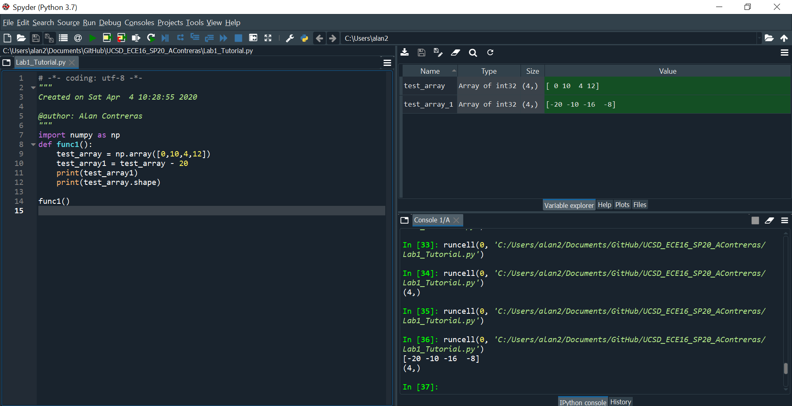

>Q. Show the code: Make a 2D array of test_2D_array from [0,10,4,12],[1,20,3,41]

>A. The attached image shows my code:
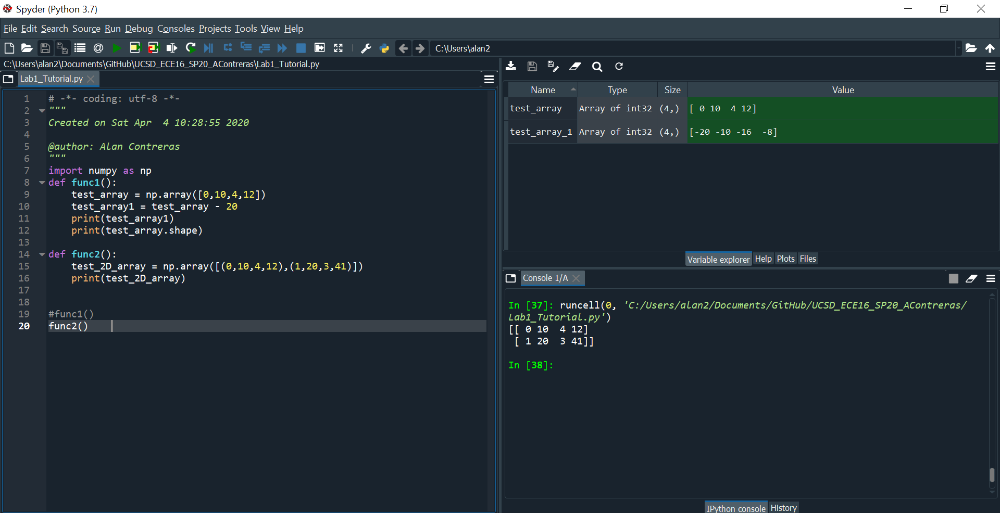

>Q. Make a 2D array of zeros with shape of 10x20 and then print it out

>A. The attached image shows my result:
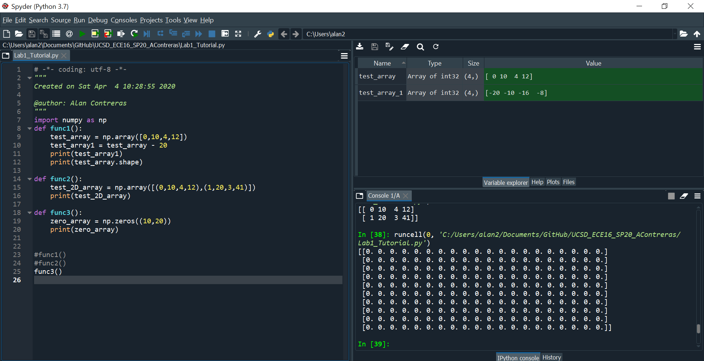

>Q. Show the code: Out of the test_array, create the following using hstack and vstack: 

>A. The attached image shows my result:
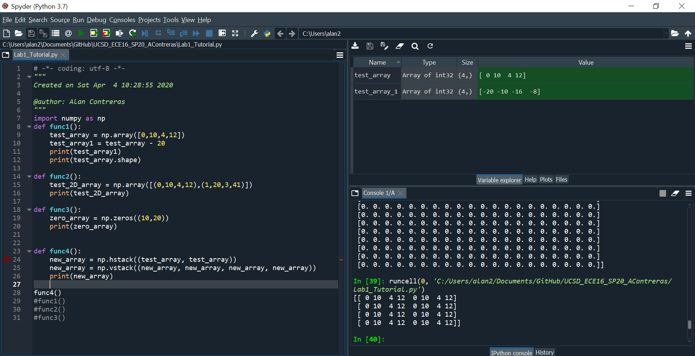

>Q.Show the code: Using arange, make an array called arange_array1 to equal [-3, 3,9,15] and arange_array2 to equal [ -7,  -9, -11, -13, -15, -17, -19]

>A. The attached image shows my result:
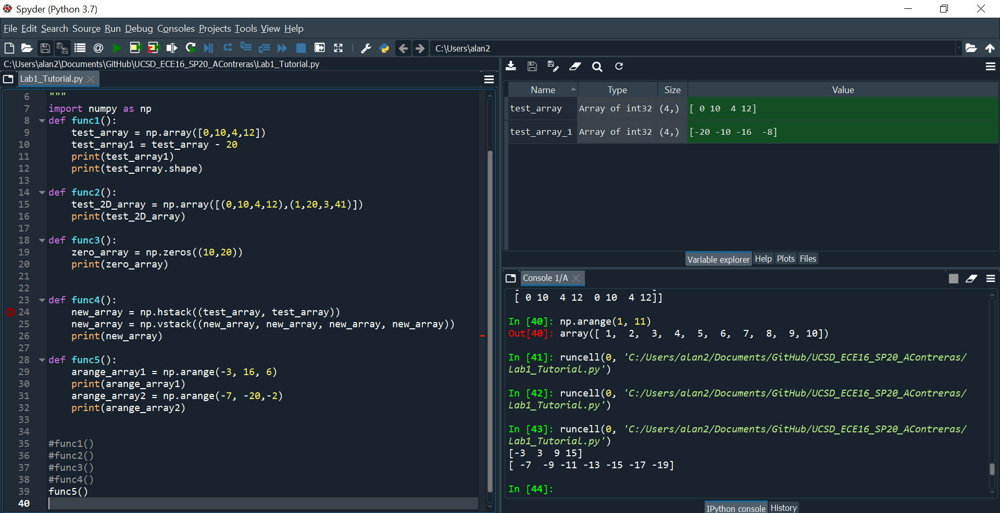

>Q.Make an array called linspace_array using linspace that goes from 0 to 100 with 49 steps. 

>A.The attached image shows my result:
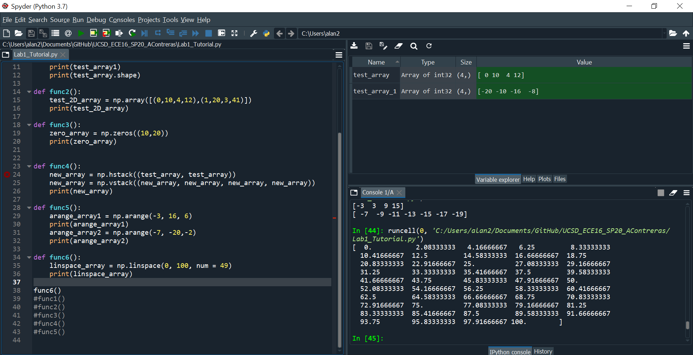

>Q.How do linspace and arange differ? When might you use one over the other?

>A. A key difference between linspace and arange is that linspace gives
>the control over the precise end value, whereas arange does not. Arange
>gives you easier control over the step inbetween spaces of the desired
>array. So linspace may be easier to use in a scenario where you want 
>a specific number of array elements and if you want to include the last 
>element. Arange maybe easier to use for smaller and more arbitray array
>creations.

>Q. What is an array of size 3x4 that would produce the following results.
>Show your work on how you deduced your answer on paper or some kind of
>graphics:

>A.Following the tutorial on array slicing and indexing, I was able to 
>come up with the array that would satsify the desired results. 
>The attached images show my process and results:
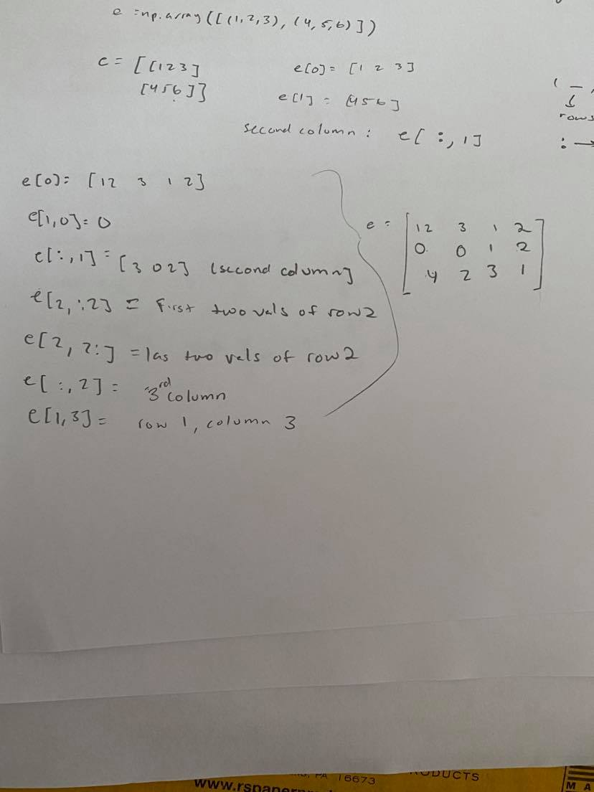
>The attached image shows my result:
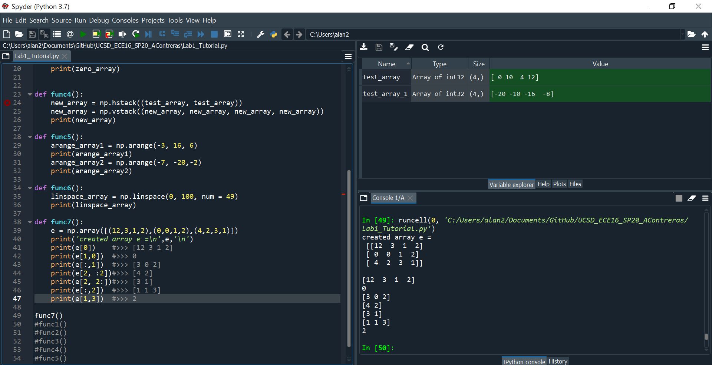

>Q. Show your code: Now solve the problem from the section Indexing and
>slicing using numpy and array assignment.

>A. The attached image shows my result:
>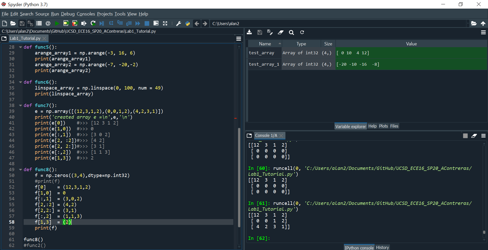

>Q. Using fromstring, vstack, and a for loop, create an array of 100x4 from s: [[1,2,3,4],[1,2,3,4],[1,2,3,4]…..[1,2,3,4]]. 

>A. The attached image shows my result:
>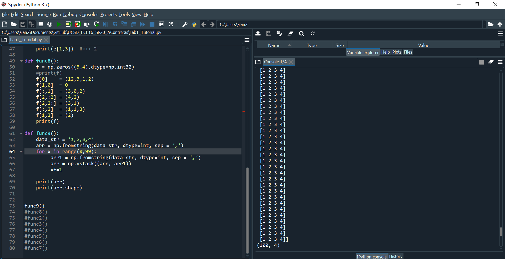
