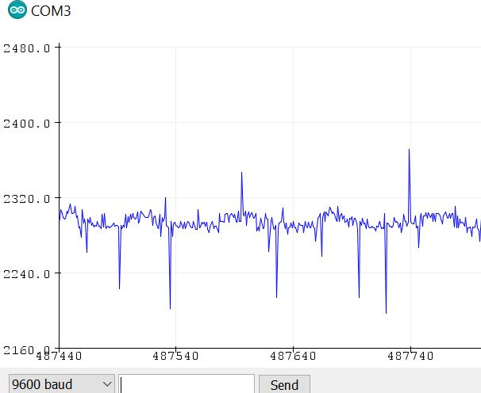

# ECE16_Lab2_Report
By: Alan Contreras A14626630

### Digital Write
>In this tutorial, I am introduced to how I can use the microcontroller
>to interact with the real world

>Q. What is the frequency of the blink rate in this example? Note that
>frequency is the inverse of the time it takes for a cycle. A cycle is the
>time it takes to go HIGH to LOW to HIGH again. Record a video of your
>ESP32 blinking. 

>A. The frequency the led is blinking is 0.667Hz. 

>

### Digital Read
>In the previous tutorial, I used digitalWrite function to use the GPIO pin
>as an output. In this tutorial, the pin is used as an input through the
>digitalRead function.

>Q. Why do we need a pull-up resistor? Describe the behavior without it.

>A. The pull-up resistor is necessary so that, essentially, the 
>communication between the LED and the microcontroller does not deal with
>any interference. Without the pull-up resistor, when I try running the
>system, the MCU actually disconnects each time I press the button,
>rather than turning on the LED. 

>

### LED
>In this tutorial, implement what I learned from previous tutorials to make
>an LED light up using the MCU. 

>Q. Which GPIO pin did you have to use according to the above setup?

>A. According to the setup, I used the GPIO pin32

>Q. What is the expected current draw?

>A. The expected current draw is 5mA.

>Q. What is the current limit for the GPIO? You can find this on the ESP32_WROOM datasheet: 

>A. The current limit is 1.1 A.     

### Serial Write

>In this tutorial, I am introduced to communication with the MCU using text.
>Through the serial communication channel, communication is accomplished. 

>Q. In your report, run the above code at Baud Rate of 9600. How many 
>seconds are between each Hello World? What did you expect the time between 
>each print statement to be and what did you actually get? 

>A. The time in between each "Hello World" is measured in miliseconds but this delay is not the 1ms 
>delay that wsa assigned in our code. The expected time between each statement, I thought would be 1ms 
>but instead I got a variation of 5ms to 30ms.

>Q. How does this change when you change the baud rate to 2400, 4800, and 115200. (When you change the 
>baud rate, you’ll also need to change the Serial Monitor’s Baud Rate. The answer to this question 
>should be quantitative and not just qualitative. Keep in mind that baud rate refers to how many bits 
>per second are sent and that an ASCII character is 8 bits.

>A. When the baud rate changes to 2400, the serial monitor prints out "Hello World!!!" at a slower
>speed, i.e. the delay is in the range of 50ms to 70ms. For 4800, the delay is sightly faster-- it 
>ranges from 30ms to 50ms. For 115200, the serial monitor does not even print out a delay-- I believe it 
>is going so fast that the monitor simply keeps printing out the statement.
>

### Challenge 1 - LED Blink Frequency

>In this challenge, I made use of what learned in the previous tutorials into writing code so that the 
>MCU may blink the different LEDs off and on.

>Q. What are the resistor values you chose for each of the LEDs?
>A. I used the 220 Ohm resistor for all of the LEDs

>Q. Videos showing each condition (please record in landscape-horizontal mode)

>A.
>Condition 1:
>
>Condition 2:
>It is difficult to see the blinking due to the conversion rates from 
>video to gif, but it was blinking in my video.
>
>Condition 3:
>
>Condition 4:
>
>Condition 5:
>
>Condition 6:
>
>
### Challenge 2: Timer - Part 1
>In this challenge, I am tasked with making a timer that runs when a button is pressed. Using the serial 
>monitor and the button tutorial tips, this task is accomplished.

>Q. What is the average time elapsed for each second iteration? Use millis() to help you with this task. 
>Describe how you measured this.

>A. The average time elipsed for each second iteration, according to the 
>millis() function was 1 sec. I got this result by placing one millis() 
>marker in the beginning of the >Lab2 Timer Loop, and then taking the 
>difference of that millis() withanother millis() marker at the end of the
>Lab2Timer Loop (see images)
>
>

### Challenge 3: Timer - Part 2
>In this challenge, a run down timer is added so that when the button is released, the serial monitor 
>counts down from where the timer was left when the button was last pressed. 

>Q. Describe in plain english the logic of your entire program. 

>A. In order to understand the code logic, I will begin by defining the 
>variable parameters. BUTTON_PIN is pretty self explanatory. BUTTON_PIN 
>is called in essentially the main function which is Lab2_C2. Another 
>variable parameter is "timer_seconds" which holds the amount of seconds 
>the timer has tracked as an integer value. This variable is used in the 
>addTimer and runTimer functions. The addTimer function is called in the 
>Lab2_C2 main function. Lab2_C2 calls addTimer() when digitalRead
>(BUTTON_PIN) == LOW --when the button is pressed-- and what addTimer 
>does is add 1 second to timer_seconds as long as the button is pressed. 
>Then the printTime() function is called which sends the timer_seconds 
>to be printed in the serial monitor. After addTimer is called, Lab2_C2 
>calls a delay of 1 second, in order to create a timer that counts 
>seconds. When the button is not pressed Lab2_C2 calls runTimer, which 
>runs a while loop that decreases timer_seconds by one second and prints 
>out each second in the serial monitor until the value in timer_seconds 
>is 0 or until the button is pressed again. 
>
>

### Accelerometer
>In this tutorial, I am introduced to accelerometer, how it operates 
>and, how it communicates through the MCU and with the computer.

>Q. How many bits is your ADC? Try connecting your A0 pin to 3.3 V. How did you calculate the bits?

>A. The ADC has 12 bit precision. This was found out by connecting the 
>A0 pin to 3.3 V and seeing that the serial plotter was plotting 4095. 
>4095 is simply the output code of the ADC, that could be represented in 
>bits, so I added 4095+1 =4096 and took the logBASE2(4096)= 12. 
>

>Q. What is the resting value of the accelerometer when it is lying face 
>up. Why is it not 0? What is this value in terms of volts (remember 
>that 3.3 V is the maximum).

>A. The resting value of the acceleremoter is 2290. It is not 0 because 
>0 is essentially a representation of the maximum negative acceleration, 
>just as 4095 is a represenation of the maximum positive acceleration. 
>Hence, 2320 is the neutral, 0 spot of this graph. In terms of volts, 
>2320 is most closely represented by 1.83 V. The Least Siginificant Bit 
>is approximately 0.805 mV. So (0.805mV)*(2290)= 1.83 V
>

>Q. Tap the accelerometer with light, medium, and hard force. What is 
>the average value of each tap? How did you calculate this? Please don’t 
>ask us if you are tapping correctly; use your judgement :) Show a
>screenshot of the accelerometer being plotted with the taps at 
>different strengths.

>A. The average value for the light, medium, and hard taps are 
>respectively, 2231, 2200, and 1780. The way I calculated these values 
>was by taking the values below the established resting threshold-- 
>essentially the minimum peaks-- adding them all together, and finally 
>dividing that sum by the number of minimum peaks. 

>
>
>

### Pulse Width Modulation
>In this tutorial, I am introduce to Pulse Width Modulation, which is 
>used to create more complex digital outputs using the GPIO pin, PWM 
>duty cycle, and PWM Frequency.

>Q. In the above figure, assuming we are showing 2ms of data, what is 
>the PWM frequency?

>A. There are 6 cycles in the figure with a total running time of 2ms. 
>Dividing 6 by .002 gives 3000Hz as the PWM frequency. 

>Q. Why is a 100% duty cycle equal 255 instead of 256?

>A. There is total bitwise representation of 256. Since the 
>representative values begin at 0, the last value would then be 255,
>rather than 256. Meaning that 255 would equal 100% duty cycle.

>Q. Surprise!!! We intentionally made some mistakes in the above 
>example. What were they? It will not work directly, but by reading the 
>compilation error, the tutorial instructions, and comments carefully, 
>you should have no trouble getting it to work! :)

>A. The mistakes where some mistakes in syntax, like some variables were 
>not copied correctly, and some semicolons were omitted. Also, 
>ledcAttachPin was called the main loop when it should have been ledcWrite. 

### OLED
>In this section, I am introduced to I2C communication and how the MCU 
>can the OLED display as a manner of communication with the real world 
>or with me.

>Q. Again, we made some intentional mistakes in the code above. What 
>were they?

>A. The misakes I found were basical some syntax errors again. There was 
>a function missing a semicolon, there were variable calls that were not 
>called approrpiately and there wasa function that was also not called 
>correctly.

### Serial Read
>In this tutorial section, I am taught how we can communicate with the 
>MCU with the serial monitor using serial read, and I am taught how we 
>can verify if the MCU recieved information.

>Q. What did the Huzzah32 receive? How does this change if you use 
>different line endings?

>A. The Huzzah received the bit values in integer and returned them. In 
>the following image, the Huzzah is shown returning the value of 1 with 
>different line endings. 
>

>Q. What are the Decimal values of NL (new line) and CR?

>A. As seen in the image above, 1 has the value of 49, the decimal value 
>of New line is 10 and the carriage return 13. 

### Challenge 4
>In this section, I learn about the ERM motor we will be using and I am 
>tasked with using what I learned previously about PWM control to make 
>the Motor move. 

>Q. Which pin does the code ask you to use for the motor?

>A. The code asks me to use motorPin which is pin 13 for the motor. 

>Q. Why can’t we achieve this speed variation using a digitalWrite and 
>instead had to use ledcWrite?

>A. digitalWrite can only use HIGH and LOW variations meaning, it will 
>either buzz fully or not at all. However, ledcWrite can vary among 
>ranges in between full buzz or no buzz and thats why we can accomplish 
>the variation that was tasked in this challenge. 
>

### Challenge 5 Gesture Detection
>In this challenge, I begin coding for a tap detection counter on the 
>MCU using the accelerometer and the OLED screen for feedback. 

>Q. What are some different approaches you tried and why? What are some 
>situations where you noticed your detection algorithm did not work well?

>A. In my first approach I decided it would be simplest to use a 
>threshold value that was basically 50-100 values less than the average 
>values I would receive for X,Y,Z based on what I could see on the 
>Serial Plotter. This approach did not respond the way I thought it 
>would. Then I noticed that it wasn't really necessary to check the X 
>reading, since in my case, the the X plot did not change in a 
>significant manner when I tapped. So then I would just check for the Y 
>and Z values and tried to range at what subthreshold level would be 
>best. But, I still did not get the response I was searching for. 
>Finally, I added an else statement that would consider the values 
>greater than the threshold level. After including these, my tap 
>detection worked better, but it seems that if I dont tap fast enough, 
>the MCU will count more taps than one. 

>Q. Provide a screenshot of a plot showing 5 taps and the threshold used. 

>A. The values I used to compare were 2240 and 1755 for Z and Y, 
>respectively, on the subthreshold level and 2320 and 1805 for Z and Y, 
>respectively, on the super-threshold level.

>
>

>Q. Include a video of you tapping on the accelerometer and the OLED 
>counting each time.

>A. 

### Challenge 6 - Read and Write to OLED
>For this challenge I am tasked with using what I learned form the Serial
>Read tutorial and form the OLED tutorial to write to the serial monitor
>and have that data be sent to the OLED through the MCU.

>Q. Video of a message typed into the serial monitor and appearing on 
>the OLED. This video should be shot WITHOUT moving the camera. 

>A. 

>Q. What happens if you write a really long message? Why?

>A. With a long message the OLED is unable to write the whole message to 
>its screen. So what seems to happen is that when a really long message 
>tries to be written to OLED, the message begins to wrap around to the 
>beginning of the display.  
>

### Challenge 7 - Non-blocking Timing Logic
>In this challenge I am tasked with using Non-blocking 
>timing logic in order to incorporate the run down timer 
>into my gesture controlled stop watch. The way it works is
>that if the accelerometer sense no taps for more than 
>three seconds, the MCU knows to start the countdown from 
>the timer that was being increased with the amount of 
>taps it was counting. 

>Q. As a thought exercise, how might you implement this 
>using BLOCKING logic? 

>A. To implement using blocking logic, I would have to 
>create an else statement that then checks for basically 
>no tap. Say the user chose to stop tapping, then this 
>else condition would check for that and thus start the 
>run down timer. 

>Q. How would you use NON-BLOCKING logic to set the 
>sampling rate of the accelerometer to 50Hz? Write it 
>out as pseudo-code. 

>A.In order to set the sampling rate of the accelerometer 
>to 50 Hz, I would go to the gesture detection part of my
>code and add timing functions to it. 

>
>

### Challenge 8 State Machine of Watch 
>This challenge is mostly about taking a step back to asses and 
>synthesize all the work that was done into one whole working machine. 
>In this challenge I take this broad overview of the different 
>challenges I have accomplished and build a state machine of the gesture 
>controlled watch that will eventually come together in the challenge 
>after this one. 

>Q. How many states do you need? Describe in words what each state does 
>and it’s transition logic. Draw the state machine.

>I needed four states in my machine. The first state, which is my "wait 
>for first tap" state, will wait for the user to tap for the first time,
>and send the machine to state 2. State 2, my "check" state, will be 
>responsible for tap detection, counting, and tap time interval checker. 
>If it detects a tap, it will add one second to the timer. If it does 
>not detect a tap in the 3 second time interval, it will go to state 3. 
>State 3, the "countdown" state, will essentially do the "countdown" of 
>the timer by decreasing what the "check" state was adding to the timer. 
>Once the timer reaches 0, the machine will advance to the 4th state, 
>"BUZZ". In this state, the machine will activate the motor, which will 
>buzz, until the user taps again. This tap will also serve to send the 
>system back to the first state, to wait for the user's initialize tap. 

>

### Challenge 9 

>This final challenge brings everything together and incorporates the 
>state machine I drew up in challenge 8. This final challenge 
>demonstrates all that I have learned so far into a real life 
>application.
>
