# ECE16_Lab3_Report
By: Alan Contreras A14626630

### Tutorial 1: Pyserial – Connecting Arduino and Python
>In this tutorial I am introduced with using Python to communicate with  
>the MCU. Using the imported pyserial, the receivedMessage function from 
>the previous lab, and Spyder, this was achievable. 

>Q1. Try running the code, but sending the message without the “.encode”.
>.. what happens? 

>A1. The console reports that the string needs to be encoded to a supported
>type. 
>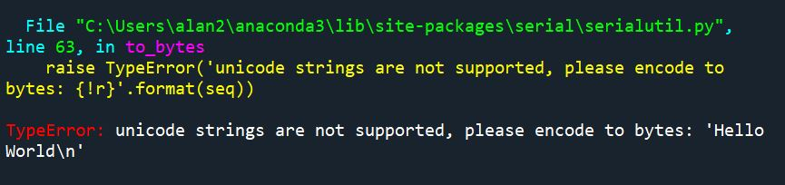

>Q2. Identify in the above code, (1) which Python command prints to 
>Python’s own console, and (2) which Python command prints to the Serial 
>port of the MCU?

>A2. The setup_serial() function prints to Pythons's own console, and the 
>send_serial prnts out to the OLED. 

>Q3. What happens if you take out the “\n” in the string? Why?

>A3. The OLED remains blank, most likely since the receiveMessage function 
>is made to wait for the newline character or else it will continue 
>storing the incoming data. 

### Receiving Data with Python
>This tutorial deals with receving data from the MCU to the Python Console.

>Q4. Describe the output you observe on the Python side? 

>A4. The output is much like the data from the serial monitor on the 
>arduino IDE. Numbers are being counted up as if addtimer is working.

>Q5. Change the code to read 10 bytes instead of 30. Now what do you 
>get? What are the 10 bytes you received? Remove decode might help 
>you understand.

>A5. I get less numbers printed out than I would with having read 30 
>bytes. The 10 bytes receieved are the numbers themselves followed by 
>a carriage return and a new line character. 

>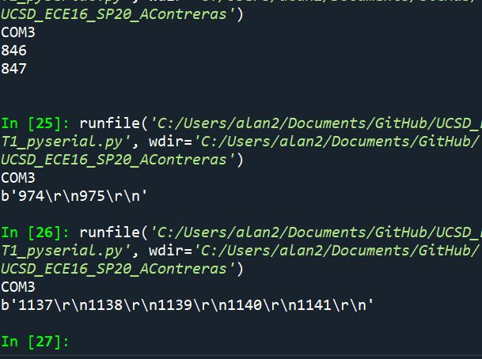

### Receiving One Byte at a Time 
>Similar to the previous tutorial but this time, I am tasked with
>receiving and printing one byte at a time. 

>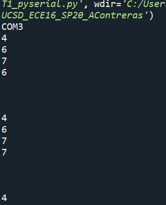
>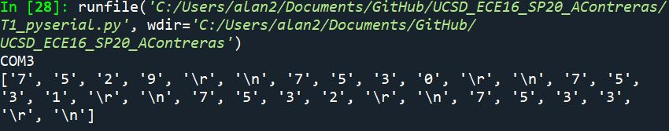

>Q6. Describe the output you observe on the Python side? Is it the same 
>as before? What does this tell you about the print() function of Python?

>A6. The output is instead the numbers being written one by one followed 
>by some newline space in between. This output seems to display that 
>Python adds carriage return as byte in the the amount bytes it can 
>print out.

### Knowing when to quit
>This tutorial section will go over when to utilize te ser.close() 
>function to ensure that the serial port won't be lecked up if we try 
>to access it again. 

>Q7. We purposely made a few errors above. What were they? 

>A7. The first error I found was that Try needs to be in lower case, so 
>'try' instead. Also the ser.read needs the decode portion as well to get
>the desired result. Lastly, in order for exit() to work properly, I had
>to import sys and call sys.exit() instead of just exit(). 

>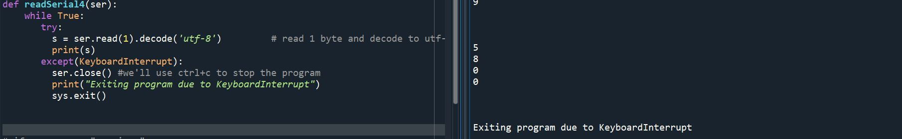

### Challenge 1: Setting Your Watch to Send Data
>In this challenge, I am tasked with using my code from Lab2 and 
>adjusting it so that when I send "stop data" through the serial monitor
>to the MCU, the Serial Monitor will stop displaying data, and when I 
>send "start data" the MCU will begin sending data to the serial monitor 
>again. 

>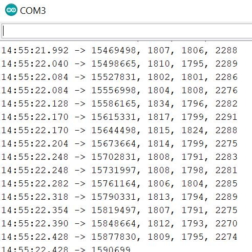
>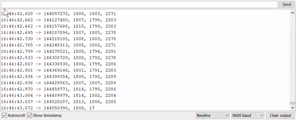

### Challenge 2: Reading Accelerometer Data
>Now I will have the MCU communicate with me through Python. Using the 
>tutorials from before and the new code given to me now, I have to 
>implement a code that will allow Python to receive the data that was 
>being sent from the previous challenge. 

>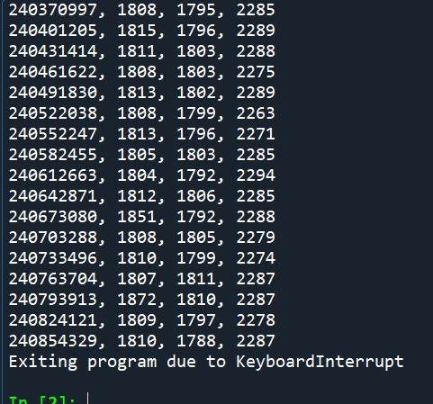

>Q1. What happens if you don’t decode the incoming char?

>A1.If I dont decode the incoming char, the Python console will not 
>output the desired data. Most likely since the parse_input function 
>reads charactersand is expecting a newline character. Since the the 
>incoming data is not decoded, parse_inputnever gets to output 
>data_string and hence nothing is displayed

>Q2. Try removing the logic for checking if the data_array is empty and 
>always vstack even if the data_array is empty. What is the error that 
>gets thrown? Why?

>A2. I get an error saying that the array input dimensions must match 
>exactly but, they don't. Since the logic was responsible for taking
>care of the first row on the array, it seems as though that the created 
>array now begins with an empty space and is immediately followed by 
>a 1x1 vector when instead we want an array that had 1x4 vectors.

>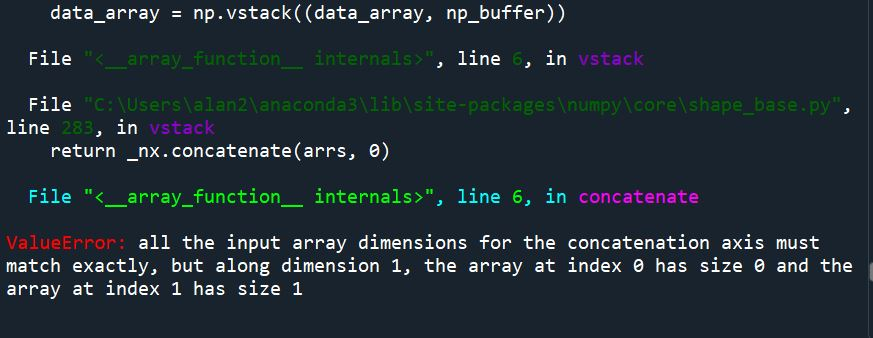

>Q3. Try removing the 1 second delay on the MCU when starting data 
>sending. Describe what happens?

>A3. Sometimes nothing happens but other times, the arduino serial 
>monitor will pick up some scrambled data and continue. Then on the 
>python side, the console will output an error saying that it can't
>decode the start byte. 

>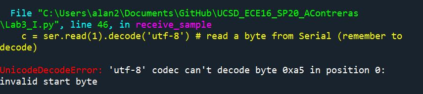

### Challenge 3: Calculate the Sampling Rate 
>I am tasked with calculating the actual Sampling Rate that Python 
>checks the accelerometer. Using the code from the previous challenge
>and slightly modifying it makes this task achievable. 

>Q1. Start with a Baud rate of 115200. What is your calculated sampling 
>rate when you set the sampling rate to 10Hz,50Hz,100Hz,1000Hz on the 
>MCU. Make a plot (using a spreadsheet program) of the actual sampling 
>rate (y-axis) vs expected sampling rate (x-axis).

>A1.  Setting the baud rate at 115200, gave me results of actual sampling
>rates at 431.46Hz, 431.46Hz, 443.06Hz, 448.03Hz, for the expected
>sampling rates 10Hz, 50Hz, 100Hz, 1000Hz, respectively. 
>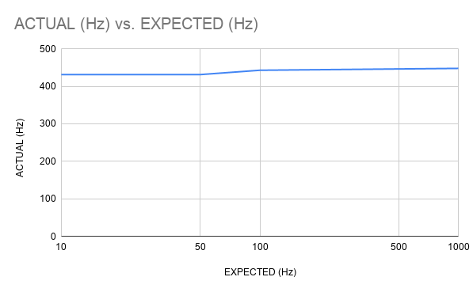

>Q2. How does this change with Baud rate 9600 vs 115200 vs 230400 vs 
>460800 .For 1000Hz, make a plot of the actual sampling rate (y-axis) vs 
>Baud Rate (x-axis).

>A2. The previous sampling rates seem to change in accordance with 
>changing the baud rate. It seems that the closest to the expected value
>was when the baud rate was set to 230400. 
>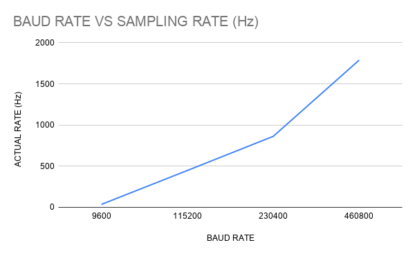

>Q3. What happens if you use millis instead of micros for timing and Why?

>A3. In this answer, I used a sampling rate of 1000Hz on the MCU. Using 
>millis instead of micros sometimes increased the actual sampling rate. 
>This is most likely a result of of how micros uses more precise values
>in timing and millis is essentially rounding the timing values and 
>thus speeding up the sampling rate. 

### Tutorial 2: Matplotlib
>This section deals with being introduce to the plotting functionality
>of python in the matplotlib library.

>Q. What was plotted? What does this tell you about how plt.plot interprets the input? 

>A. The plot shows that when python tries to plot a 2d array, such as in
>this case, the color refers to a certain element and the values on the
>the y axis of the resulting graph correspond the elements aligned in
>the array. So looking at the aligned values on the axis = 3 of the given
>array, (the red line) we have a starting value of 4 and an endvalue of 
>16 

### Challenge 4: Plotting Accelerometer Data
>This section required me to take the accelerometer data from the MCU and
>plot it using the python plot library I learned in the previous tutorial

>Deliverable: Show a gif of you starting your code, and end with the 
>plot appearing. Also include a still image of the plot. 

>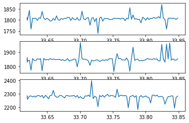
>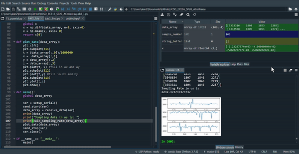

### Challenge 5: Wireless Data Transmission
>In this challenge, I take my accelerometer data from the MCU once again 
>and send it to python though bluetooth communication. In python, I 
>graph the data accodingly 

>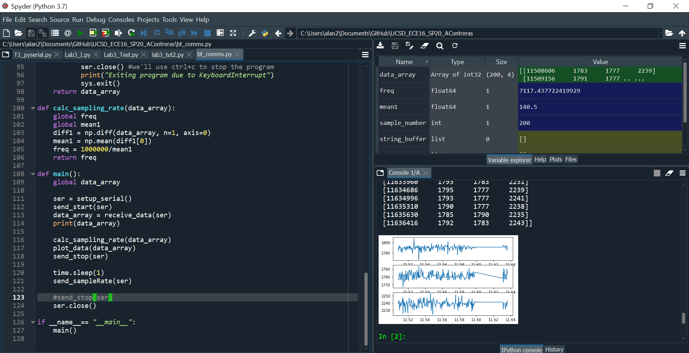
>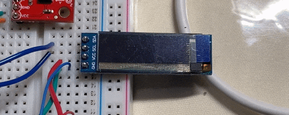

### Challenge 6: WeatherAPI & Creative Watchfaces
>In this concluding challenge, I take what I have learned from previous 
>challenges and apply them to create a refreshing watchface. In my code, 
>I had a lot of cross-communication in order to make sure python had sent
>data to the MCU and the MCU sent a confirmation to python, and 
>vice-versa. In the end, my code worked, and I was able to display the 
>current status, the current temperature and the humidity. I selected 
>these because they were easier to append to each other and also managed
>to fit on one row of the OLED. I was hoping that this will make it 
>easier for me to add more to the watchface if need be on future labs. 

>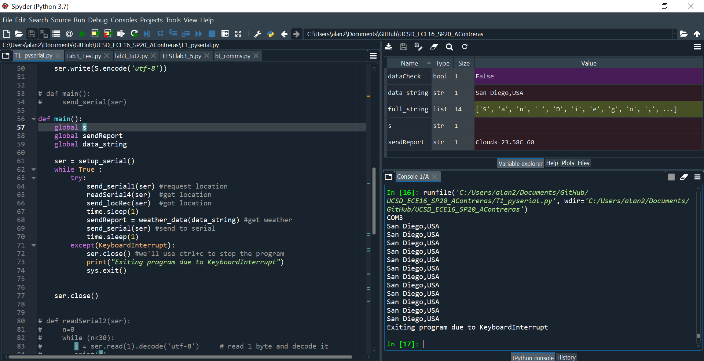
>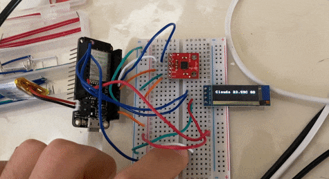

