# ECE16_Lab4_Report
By: Alan Contreras A14626630

### Tutorial 1: OOP
>In this tutorial, I learn to use Object Oriented Programming, which is
>one of the functionalities of Python that makes it so powerful. 

>Q1. Describe the output of the print(scout) statement. 

>A1. I did not get the attributes that I assigned printed out, but rather
>I received a hexadecimal address, most likey indicating where the data is
>stored in memory. 

>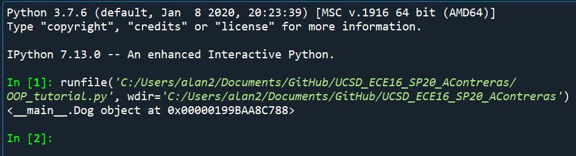

>Q2. Show the code and the output: Instantiate an object of class Dog 
>with the following attributes: skippy, 5, Golden Retriever. Did you have 
>to get rid of the previous dog to do it?

>I did not have to get rid of the previous dog to instantiate the next dog

>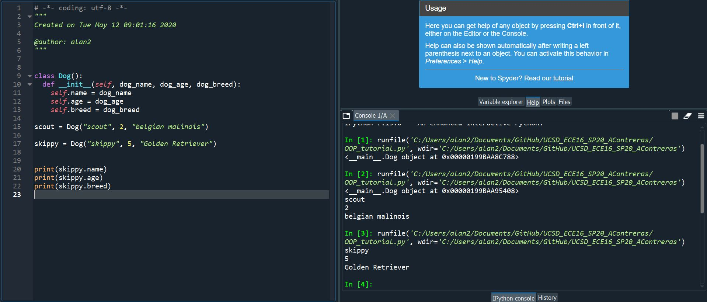

>Q3. Show the code and the output: Using the method define_buddy() makes 
>scout and skippy buddies. Use the instance scout to print the 
>description of its buddy with the new attribute.

>A3:
>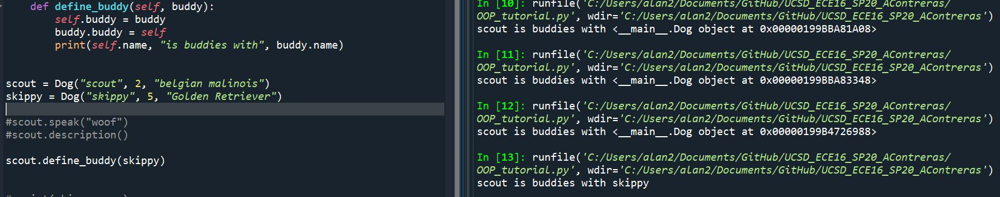

### Challenge 1: Object-Oriented Programming Restructuring
>In this challenge, I take what I learned about OOP from the first 
>tutorial and apply it to restructure my prvious lab code to make it use
>OOP. 

>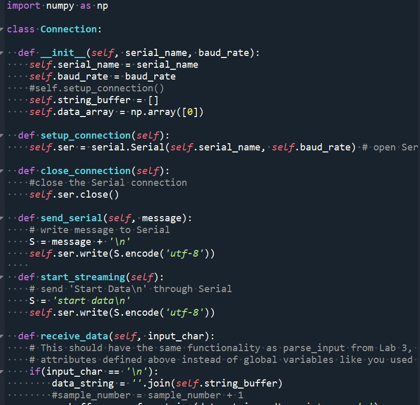
>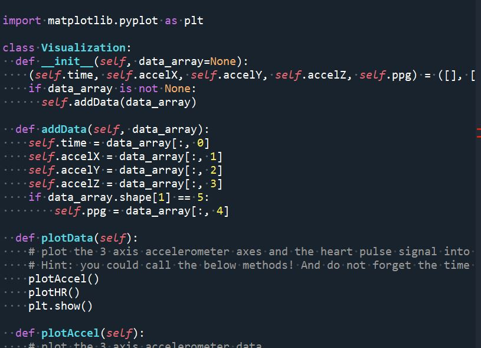
>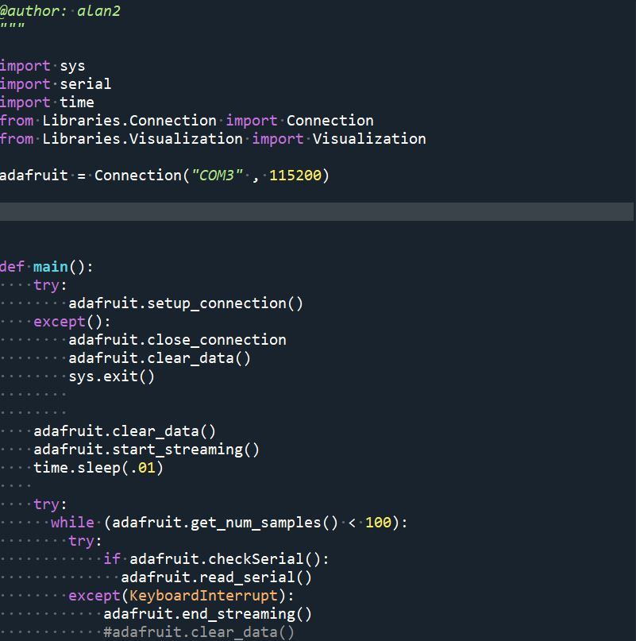
>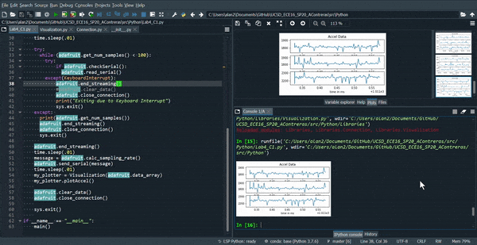

### Tutorial 2 Pulse Sensor and File I/O

>Q1. Note that you can connect both the heartbeat sensor 
>and your OLED at the same time, both of which use the I2C 
>SDA and SCL lines. Why does this work?

>A1. This works becuase I2C uses has packets split up into address 
>portions of said packet and then the data portion of the packet.
>This is what allows I2C to receive data from different devices

>Q2. Notice the while(1) statement. What happens if the 
>device is not connected? What happens if the error is 
>printed and then you connect the device? Will the code 
>proceed? Try it and describe the behavior.

>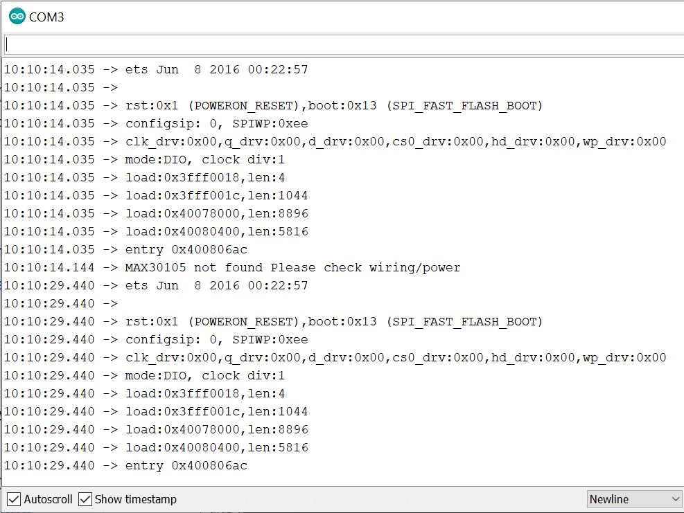

>A2. When the device is not connected the serial monitor prints out a 
>report that highlights the given error, which is that the device is 
>not found due to wiring or power. If the device is connected after this 
>error report, another report will be displayed; however, this report does
>not report that the sensor is not found. 

>Q3. What would the settings look like if you were to: set the led 
>brightness to 25mA, use only the Red + IR LED, Sample at 200Hz, and use 
>an ADC range of 8192?

>A3: 
>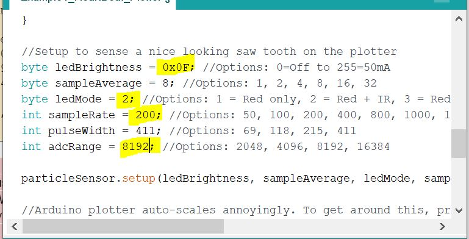

>Q4. What are the units of the pulse width? Would the bigger pulse width 
>result in a more intense or less intense measurement? Why?

>A4. The units of pulse width are micro seconds. A bigger pulse width 
>would most likely correspond to a less intense measurement. For longer  
>pulse widths, the serial plotter shows more rounded edges, whereas for 
>shorter pulse widths, one does see smaller peaks coming up here and 
>there. With shorter pulse width, there would be more frequent sampling, 
>which results in this smaller peaks being captured by the sensor

>larger pulse width:
>>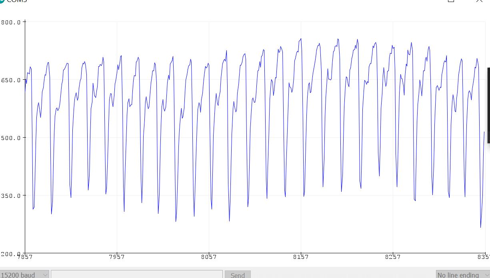
>smaller pulse width:
>>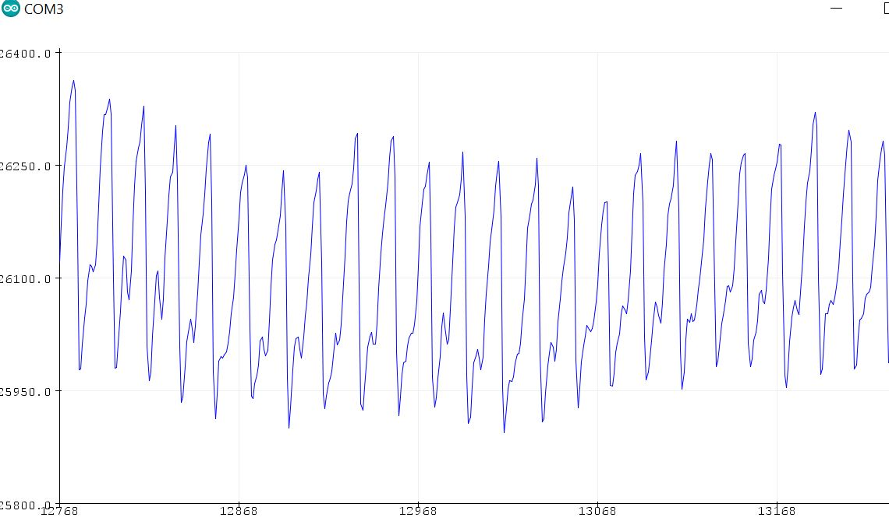

>Q5. How many bits are needed for an ADC range of 16384?

>A5. 14 bits are needed for an adc range of 16384

>Q6. What is the peak wavelength of the R, IR, and G LEDs?

>A6. The peak wavelength of IR is 900 nm, for R, 670nm, and for G, 545 nm.

>Q7. If you want to read the Green value, what Mode do you need the 
>setting to be in and what function will you need to use to get the green 
>signal (HINT: it is not getIR()!).

>A7. The .setLEDMode() was to be 3 for Red + IR + Green LEDs and the read 
>value function has to be the getGreen() function instead of getIR().

>Q8. In order to verify the signal, please take a screenshot of the Serial 
>Plotter and circle where you think the peaks occur that are related to 
>your heartbeat (this exercise is to make sure you’re getting a clean 
>signal before moving onto Python).

>A8. The brown circles corresponds to the systole peak, the blue ones to 
>the dicrotic notch, and the red line indicates beat-to-beat duration.
>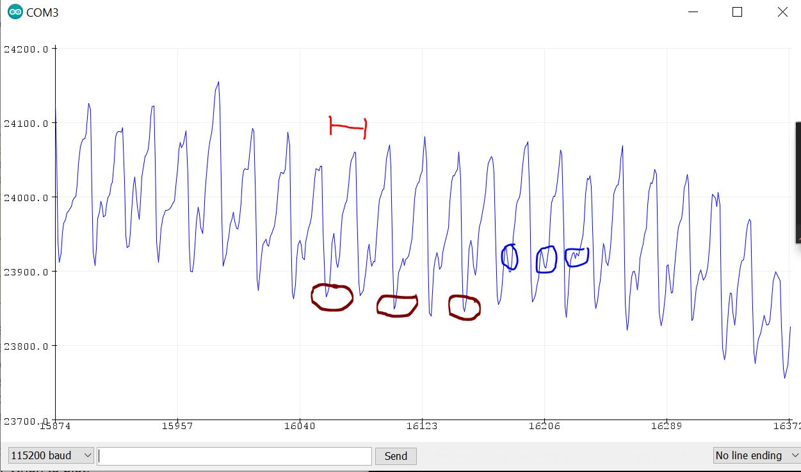

>Q9. Try your best to replicate the above plot by shaking your 
>accelerometer. The above was sampled at 50Hz for 10 seconds. Make a gif 
>of you running your program, shaking your accelerometer, and a plot 
>showing up similar to the one above.

>A9. 
>
>

>Q10. What is approximately the frequency of oscillation of the 
>accelerometer’s x-axis signal in the plot above? 

>A10. There are approximately 4 oscillations per every 2 microseconds so, 
>2Mhz

### Challenge 2
>I am tasked with taking what I learned from using the pulse sensor and 
>the File IO implementation to add the pulse sensing data onto 
>the 4th and final subplot I am required to add to my data plot.

>Q1. Why do we plot the negative of the signal? This has to do with light absorption. We talked about it in class!

>A1. The sensor reads the reflection of the light from the blood in the
>finger. So when the heart pumps more blood is being sent through the
>finger blood vessels, and with more blood there will be less light 
>being reflected. This is why there is a minimum peak in the heart beat
>amplitude and why it is necessary to take the negative of the signal. 

>Q2. Try different sampleAverage parameters and plot them. What is the effect of sampleAverage on the smoothness of the signal? 

>A2. Incresing sampleAverage will decrese the smoothness of the signal, 
>whereas decreasing the value will increase it.

>

>Q3. Try different ledBrightness. Is brighter always better? Why or why 
>not.

>A3. Having a brighter LED does not really affect the sensor data. I 
>noticed that having a brighter LED usually perfroms better in a brighter 
>environment. But in most cases, it is not really necessary to have a 
>brighter LED.

>Deliverable 1: Tune the settings so that you ultimately get a sampling 
>rate of 50Hz. What setting did you land on that gave you a clean signal 
>and at the right sampling rate? Show a gif of you starting your code, 
>and end with the plot appearing. Also include an image of the plot. 

>
>
>

>Deliverable 2: Finally perform the above challenge using the Bluetooth 
>connection you set up in Lab 3. Show a gif of the Python console 
>receiving and plotting the data.

>A2. In the following screen recording, COM4 is the serial port for BT 
>communication

>
>

### Tutorial 3: PPG Filtering
>Here I learn different ways to smooth out and display meaningful data 
>from my results. The goal is to ultimately, apply what I learn here to 
>generate a good Heart Beat sensor graph. 

>Q1. Try different n_avg and document, with plots, the result for a few different n_avg and describe which n_avg worked well in emphasizing the taps? 

>A1. Using the sample file, the best results came when n_avg was 2
>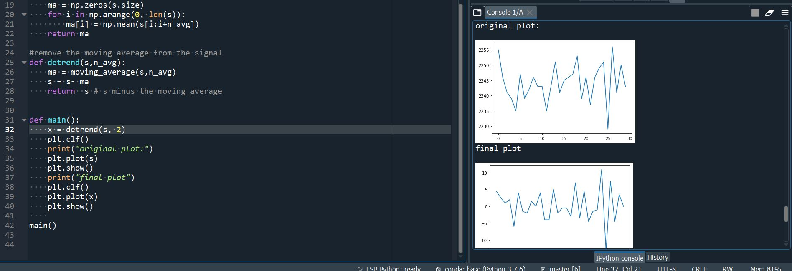

>Q2. Try using signal_diff(s) to calculate the gradient of the signal s and plot the signal.

>A2. The gradient of the signal is plotted below:
>

### Challenge 3 Heart Rate Calculation
>In this section, I am to use to pulse signal to calculate the heart rate
>from a recording. I am tasked with getting a ground truth, using what I 
>learned from filtering an normalizing signals in order to get a good 
>heart beat detector, so that I result with adequate Heart Rate data.  

>I measured my resting heart rate using my fingers to count the pulses 
>from my wrist. I measured having 84 bpm. 

>Q1. Note that it is very important to normalize AFTER you’ve done the 
>filtering. Try normalizing before filtering and describe what happens 
>and why it doesn’t work for helping with determining a threshold.

>A1. When I normalize before filtering the signal is not within the range 
>of 1 and 0 which makes it difficult to to compare with the threshold I 
>had found to be the most adequate.

>Q2. What threshold did you find to work well and how did you determine 
>it?

>A2. Originally, I attempted to use a threshold on the signal and find
>the heart rate from that. However I used the diff function to calculate
>the gradient and I used a threshold of 0.07 on this signal gradient 
>in order to get the desired heart rate 
>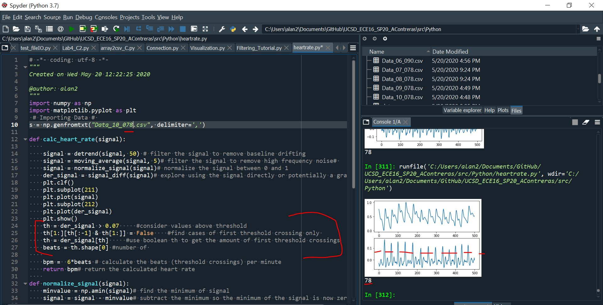

>Q3. Show a scatter plot of your heart rate calculation (y-axis) vs the 
>reference (ground truth) heart rate. Calculate the Root Mean Squared 
>Error (RMSE) of your detected heart rate vs the reference heart rate. 
>RMSE is calculated as “the square root of the mean of the square of the 
>difference” between the estimated heart rate and the reference heart 
>rate. 
>My RMSE was 3.7947. I believe that if I had used a smart watch, rather 
>than actually counting my pulse, maybe my results for RMSE 
>would improve
>

### Challenge 4: PPG
>Taking in all I have learned bout OOP and Python programming overall in 
>the previously done tutorials and challenges, I am t fully integrate
>my code into a Wearable class and a PPG class. Within these classes
>I'll be able to send data and receive data from the MCU to the Python 
>console and vice versa and produce a nice heartbeat sensor and return an 
>adequate calculated heart rate. 

>Q1. We made a few mistakes in the above code, identify them and fix 
>them. :)

>A1. Besides just filling some of the omitted code, one of the mistakes 
>that I should have caught faster was the Visualization call. 
>Fortunately, I figured it out. The following images show the code I 
>added in red, and the mistakes corrected in green. 
>
>

>Q2. Now add a new module in Libraries called PPG.py for the heart rate 
>and signal processing methods we created in this lab. Then in the 
>Wearable.py, complete the code to calculate heart rate and display the h
>heart rate on your OLED. Show in a gif capturing the pulse for 10 
>seconds, plot the signal, and print out the calculated heart rate on 
>both the console and OLED. 

>
>
>
>
